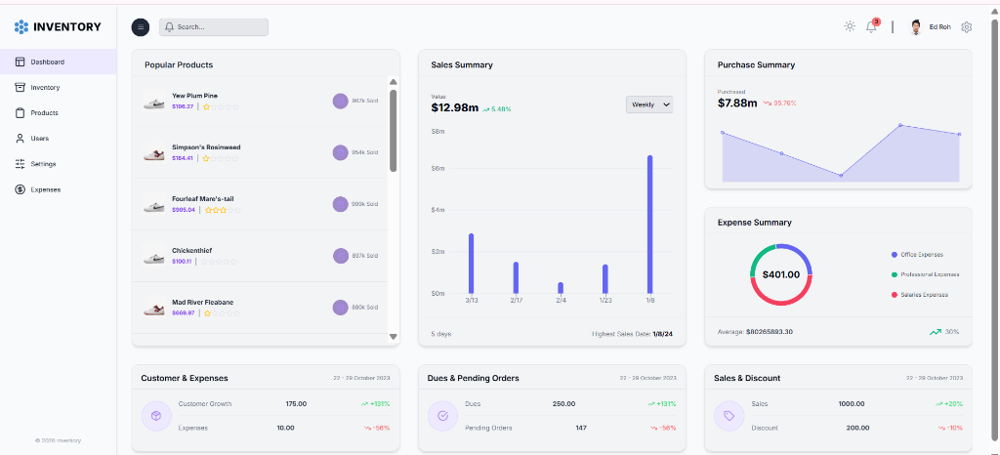

# Inventory Management Dashboard

## Overview

This is a comprehensive full-stack **Inventory Management Dashboard** designed to streamline business operations. It provides real-time insights into inventory levels, sales performance, expenses, and user management. The application features a modern, responsive user interface with both **Light** and **Dark** modes to suit user preference.

## Key Features

*   **Interactive Dashboard**: Visualizes key metrics such as sales summary, purchase summary, and expense breakdown using dynamic charts.
*   **Inventory Management**: Track product stock levels, pricing, and ratings.
*   **User Management**: efficient system to manage application users.
*   **Expense Tracking**: Monitor and categorize operational expenses.
*   **Dual Theme Support**: distinct and harmonized **Light (White/Purple)** and **Dark (Gray/White)** themes.
*   **Responsive Design**: Optimized for desktop and mobile devices.

## Tech Stack

### Frontend
*   **Next.js**: React framework for server-side rendering and static site generation.
*   **Tailwind CSS**: Utility-first CSS framework for rapid UI development.
*   **Redux Toolkit**: State management for predictable application state.
*   **Material UI Data Grid**: Powerful data tables for displaying complex data sets.
*   **Recharts**: Composable charting library for React.

### Backend & Database
*   **Node.js**: JavaScript runtime for the backend server.
*   **Prisma**: Next-generation ORM for database interaction.
*   **PostgreSQL**: Relational database.

## Copyright

&copy; 2026 Inventory Management. All rights reserved.
<<<<<<< HEAD
=======

>>>>>>> b0a68f0f76914f531d2cc3f440b657bef419b187
